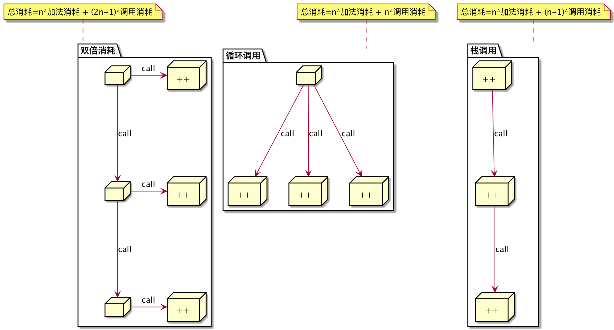

# 压测结果

### 方法调用与普通加法运算的性能对比

```text
go test -gcflags=all="-N -l" -run=. -bench=Basic -count=5
goos: darwin
goarch: amd64
pkg: github.com/xnslong/benchmark-go
BenchmarkBasic/plus-8           558065978                2.08 ns/op
BenchmarkBasic/plus-8           572090719                2.12 ns/op
BenchmarkBasic/plus-8           565462380                2.19 ns/op
BenchmarkBasic/plus-8           533984989                2.17 ns/op
BenchmarkBasic/plus-8           555679914                2.23 ns/op
BenchmarkBasic/call_func-8      468455794                2.54 ns/op
BenchmarkBasic/call_func-8      472724515                2.72 ns/op
BenchmarkBasic/call_func-8      503349939                2.81 ns/op
BenchmarkBasic/call_func-8      494187294                2.48 ns/op
BenchmarkBasic/call_func-8      497432827                2.35 ns/op
PASS
ok      github.com/xnslong/benchmark-go 14.955s
```

```
BenchmarkBasic/plus             557056796	±14421296	±2.158	±0.0589
BenchmarkBasic/call_func        487230073	±15614368	±2.58	±0.1850
```

### 栈调用与循环迭代的性能对比

```text
go test -gcflags=all="-N -l" -run=. -bench=Stack -count=5        
goos: darwin
goarch: amd64
pkg: github.com/xnslong/benchmark-go
BenchmarkStack/A:loop-8                  2930137               411 ns/op
BenchmarkStack/A:loop-8                  2985661               401 ns/op
BenchmarkStack/A:loop-8                  2989432               402 ns/op
BenchmarkStack/A:loop-8                  3005659               393 ns/op
BenchmarkStack/A:loop-8                  3016893               397 ns/op
BenchmarkStack/B:stack-8                 2944824               412 ns/op
BenchmarkStack/B:stack-8                 2930708               409 ns/op
BenchmarkStack/B:stack-8                 2925718               407 ns/op
BenchmarkStack/B:stack-8                 2910595               409 ns/op
BenchmarkStack/B:stack-8                 2958751               409 ns/op
BenchmarkStack/C:stack2-8                2196970               559 ns/op
BenchmarkStack/C:stack2-8                2159953               556 ns/op
BenchmarkStack/C:stack2-8                2156610               552 ns/op
BenchmarkStack/C:stack2-8                2184256               553 ns/op
BenchmarkStack/C:stack2-8                2155498               559 ns/op
PASS
ok      github.com/xnslong/benchmark-go 25.492s
```

```text
BenchmarkStack/A:loop-8		2985556.4	±33438	400.8	±6.723
BenchmarkStack/B:stack-8	2934119.2	±18418	409.2	±1.788
BenchmarkStack/C:stack2-8	2170657.4	±18834	555.8	±3.271
```

解释说明


